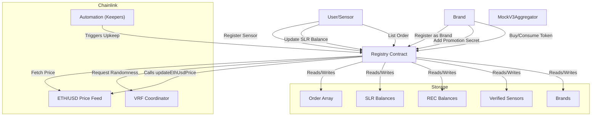

# SolarNet Registry Smart Contract System

## Overview

The **Registry** contract is the core of the SolarNet platform, managing:
- Sensor registration and verification
- SLR (SolarNet Token) balances and trading
- Brand and promotion management
- Buy/sell/option orders for SLR tokens
- Chainlink integrations for price feeds, automation (keepers), and randomness (VRF)

The contract is designed to be modular, secure, and extensible, leveraging Chainlink's decentralized services for reliable off-chain data and automation.

---

## Architecture

### Key Components

#### 1. **Sensor Management**
- **Verified Sensors:** Maintains a list of hashed sensor codes that are considered "verified."
- **Gen Stations:** Maps sensor codes to owner addresses.
- **Authorized Sensors:** Only authorized addresses can update SLR balances.

#### 2. **Token Balances**
- **SLR Balances:** Tracks SLR token balances for each user.
- **REC Balances:** Tracks Renewable Energy Certificate balances for brands.

#### 3. **Order System**
- **Order Struct:** Represents buy/sell/option orders for SLR tokens.
- **Order Array:** Stores all orders.
- **Active Orders:** Tracks currently active order IDs.

#### 4. **Brand & Promotion Management**
- **Brands:** Users can register as brands.
- **Promotion Secrets:** Brands can set a secret for promotions.
- **Eligible Promotions:** Tracks which users are eligible for which promotions.

#### 5. **Chainlink Integrations**
- **Price Feeds:** Fetches the latest ETH/USD price for market operations.
- **Keepers (Automation):** Automates periodic tasks like price updates and option expiry.
- **VRF (Randomness):** Selects random orders for audits or other random events.

---

## Contract Flow Diagram

---

## Chainlink Integrations

### 1. **Price Feeds**
- **Purpose:** Fetches the latest ETH/USD price for market operations and SLR token pricing.
- **Implementation:**
  - Uses `AggregatorV3Interface` to call `latestRoundData()`.
  - Updates `lastEthUsdPrice` and checks for significant price changes.
  - Reverts if price data is stale or invalid.

### 2. **Keepers (Automation)**
- **Purpose:** Automates periodic tasks such as:
  - Updating the ETH/USD price
  - Checking and expiring options
- **Implementation:**
  - Implements `checkUpkeep` and `performUpkeep` from `AutomationCompatibleInterface`.
  - `checkUpkeep` determines if upkeep is needed (price update, option expiry).
  - `performUpkeep` executes the required actions.

### 3. **VRF (Randomness)**
- **Purpose:** Selects random orders for audits or other random events.
- **Implementation:**
  - Uses `VRFConsumerBaseV2` and `VRFCoordinatorV2Interface`.
  - Requests randomness with `requestRandomWordsForPurpose`.
  - Handles fulfillment in `fulfillRandomWords`.

---

## Main Business Logic

### Sensor Registration & Verification
- **addGenStation:** Registers a sensor code to the sender's address.
- **checkVerifiedSensors:** Checks if a sensor code is in the verified list.
- **addAuthorizedSensor:** Admin-only; authorizes an address to update SLR balances.

### SLR Token Management
- **updateSLRTokenBalance:** Only authorized sensors can update SLR balances for a station.
- **returnSLRBalance:** Returns the SLR balance for the caller.

### Order System
- **listOrder:** Lists a new sell/order for SLR tokens.
- **createBuyOrder:** Fulfills a buy order, transferring SLR tokens and funds.
- **consumeToken:** Brands can consume tokens, triggering promotions if eligible.
- **takeOnOption:** Users can take an option on an order.
- **endOption:** Admin can end an option, returning tokens to the seller.
- **redeemTokens:** Admin can redeem tokens from a user.

### Brand & Promotion Management
- **registerAsBrand:** Registers the caller as a brand.
- **addPromotionSecret:** Sets a promotion secret for the brand.
- **addEligiblePromotions:** Brands can add eligible promotions for users.
- **getAllEligiblePromotions:** Returns all promotions a user is eligible for.

### Chainlink-Driven Functions
- **updateEthUsdPrice:** Fetches and updates the latest ETH/USD price.
- **performUpkeep:** Called by Chainlink Keepers to automate price updates and option expiry.
- **requestRandomWordsForPurpose:** Requests randomness for audits or other random events.

---

## Security & Admin Controls

- **Ownable:** Only the contract owner can add/remove admins.
- **ReentrancyGuard:** Protects against reentrancy attacks on sensitive functions.
- **onlyAdmin:** Restricts certain functions to admins or the owner.
- **onlyAuthorizedSensor:** Restricts SLR balance updates to authorized sensors.

---

## Deployment & Testing

- **MockV3Aggregator:** Used in tests to simulate Chainlink price feeds.
- **Comprehensive Test Suite:** Covers all business logic, Chainlink integrations, and edge cases.
- **Node.js LTS Required:** For full compatibility with Hardhat and ethers.js.

---

## Extensibility

- **Chainlink Functions/CCIP:** Placeholders exist for future integration with Chainlink Functions (off-chain computation) and CCIP (cross-chain interoperability).
- **Promotion & Brand Logic:** Easily extendable for more complex business rules or reward mechanisms.

---

## Example Usage

1. **Sensor registers and is verified.**
2. **Sensor updates SLR balance via authorized call.**
3. **User lists SLR tokens for sale.**
4. **Brand registers, sets a promotion, and consumes tokens.**
5. **Chainlink Keepers automatically update price and expire options.**
6. **Random audits are triggered via Chainlink VRF.**

---

## Conclusion

The SolarNet Registry contract is a robust, extensible, and secure platform for managing decentralized energy tokens, brands, and promotions, with deep integration of Chainlink's decentralized services for price feeds, automation, and randomness.

---

**For further details, see the inline NatSpec comments in the contract and the test suite for usage examples.** 